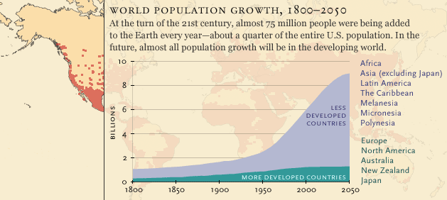

"Zero Waste", in italiano rifiuti zero. È circa un anno che simpatizzo e sto dietro a questo stile di vita. Ho fatto passi da gigante degli ultimi mesi e ce la sto mettendo tutta anche se spesso ho qualche dubbio sulla fattibilità e il reale vantaggio che l’ambiente ne può trarre. Dopo tanto pensare sono arrivata ad alcune convinzioni mentre altre opinioni sono sempre sotto giudizio.

Durante il mio triennio all’università ho studiato Economia Ecologica, Ecologia, Georisorse, Geochimica e una serie di altre robe che mi hanno fatto capire alcune cose sulla terra:

1 è sovrappopolata da noi, 2 le risorse non sono infinite, 3 la terra e la vita va avanti anche senza la nostra specie, 4 la plastica è una grande invenzione, 5 la plastica è una pessima invenzione.

1. ### Già Malthus si preoccupava della sovrappopolazione.
L’ecologia ci dice che una popolazione cresce fino a raggiungere un limite che è dato dalla disponibilità delle risorse e che in natura le popolazioni tendono a oscillare, con picchi e minimi collegati sempre alla disponibilità di risorse. Esempio easy: le volpi mangiano le lepri che mangiano l’erba la cui abbondanza oscilla con la stagione (no non è “alla fiera dell’est"). Il numero di volpi aumenta se ci sono più lepri da mangiare e le lepri aumentano se ci sono piante da mangiare che ci sono a seconda che ci sia stata abbondanza di acqua in primavera o se non è stato troppo freddo in inverno.

2. ### Aumento della popolazione mondiale dal 180 al 2050
Gli ecosistemi sono molto importanti per la società e l’economia, ci forniscono una serie di risorse, che possiamo definire “rinnovabili" se trattare con riguardo. A noi queste risorse ci servono per mandare avanti questa macchinetta chiamata umanità e questi servizi ecosistemici hanno un indubbio valore economico: le foreste migliorano la qualità dell’aria, gli oceani ci forniscono (oltre che molto ossigeno) il pesce che mangiamo e il mangime per il cibo animale che mangiamo, il suolo è fondamentale per la crescita delle nostre culture e l’atmosfera ci protegge da radiazioni solari per noi dannose. Non rendendoci conto di tutto ciò e aumentando esponenzialmente di numero abbiamo alla fine abbattuto alberi, incidendo sulla qualità della vita e sui climi, disperso sostanze e materiali negli oceani, arrivando persino a mangiare cibo inquinato, sfruttato il suolo fino a renderlo sterile e modificato la composizione dell’atmosfera.
Il fatto che ci sia una grande quantità di una risorsa non significa che questa sia infinita, I parenti che dobbiamo salutare e sopportare per Natale sembrano veramente infiniti, ma alla fine Sì!, arriviamo sempre alla fine del tunnel del “Ma quando ti laurei? Il lavoro? E la fidanzatina?".
Da Natale catapultiamoci all’isola di Pasqua, esempio classico. La popolazione che ci viveva ha finito tutti gli alberi disponibili, senza attendere la loro ricrescita e blablabla alla fine sull’isola sono morti tutti perchè avevano finito le risorse. Quindi se non stiamo attenti al tempo di rigenerazione di una risorsa rinnovabile allora possiamo direttamente considerarla una risorsa non rinnovabile.
 

3. Ma alla fine chissenefrega, possiamo anche estinguerci, avremo distrutto tutto quello che ci sta intorno e non avremo più il cibo perchè tutto è troppo inquinato, il clima sarà completamente inadatto per i nostri standard di vita e poi magari mettiamoci anche un asteroide che colpirà la terra e gli americani non sono riusciti a fermarlo nei tre minuti prima dell’impatto. La Paleontologia ci dice che la vita sulla terra ha affrontato sfide ben peggiori, noi saremo estinti, ma qualche bel batterietto e qualche altro organismo superstite darà il via a una stupenda radiazione adattativa e la terra si ripopolerà in un batter d’occhio geologico.
E’ solo a noi che interessa del nostro futuro, alla fine la tutela dell’ambiente può essere vista come un atto egoistico in favore delle generazioni future di umani. La tutela della terra, della nostra casa è volta a tutelare il nostro interesse. Quindi se non vi piace vederla nell’ottica di salvaguardare la biodiversità attuale, fatelo nell’ottica di salvare i vostri futuri nipoti.
 

4. Parliamo della PLASTICA, WOW!, penso che la plastica sia fighissima, solo a livello chimico: una serie polimeri tutti interconnessi tra loro e per di più generati dall’uomo. BOOM! Veramente una conquista scientifica e per la società. La facilità di lavorazione e le caratteristiche del materiale hanno permesso la produzione di oggetti monouso aumentando notevolmente l’igiene alimentare e sanitaria. La plastica ha cambiato completamente il nostro mondo, non si può non riconoscere il suo ruolo, storico, sociale ed economico.
 

5. Come la maggior parte delle cose anche la plastica ha i suoi contro. Come Don Draper di “Mad Man", nessuno negli anni ‘70 si rendeva conto che fine avrebbero fatto tutti rifiuti non organici di un picnic dopo essere stati abbandonati sul prato e scossi dal telo come normali briciole. E così abbiamo continuato a non rendercene conto fino a che tutti hanno iniziato a farlo e la spazzatura è diventata così tanta da essere antiestetica, così il problema è stato portato lontano dagli occhi, giù fino alle discariche. Oggi qualche rifiuto si vede sempre a ridosso delle strade e di quello che finisce in discarica non sappiamo bene cosa accada, però in qualche modo qualcosa finisce in mare (ehm, attraverso i fiumi, I guess), i sacchetti vengono scambiati per meduse e mangiati, la spazzatura, trascinata dalla corrente forma delle isole galleggianti negli oceani e la plastica si smantella in micropezzetti che vengono ingeriti dai pesci, che BAM! finiscono nei nostri piatti, ed ecco come perchè poi ci interessa.

`youtube:https://www.youtube.com/embed/roREnVhd_og`

Ho visto qualche documentario strappalacrime dove si vedono, tartarughe con cannucce conficcate nel corpo, paesi in Africa costruiti sulla spazzatura, dove le persone soffrono di svariate patologie a causa di quella stessa plastica che ha aumentato l’aspettativa di vita nei paesi “industrializzati", ma non sono stati tutti questi documentari a farmi veramente rendere conto della quantità immensa di imballaggi nella giornata tipo, nè vedere il bidone della plastica completamente pieno in poco tempo. Non c’è  stato un momento in cui nel mio cervello è scatato qualcosa, ma più un lento rendersi conto, giorno dopo giorno, ogni azione quotidiana dopo l’altra, un po’ alla volta; prima mi sono resa conto di poter eliminare le bottiglie di plastica del supermercato, poi la bottiglietta a scuola, poi il caffè alla macchinetta, i sacchetti ai negozi, man mano ho capito che qualche piccola azione ogni giorno poteva aiutare in piccola parte a ridurre la quantità di spazzatura che avrebbe poi messo migliaia di anni a biodegradarsi rimanendo nell’ambiente, da qualche parte del mondo.
Penso che sia impossibile produrre zero rifiuti perchè per mantenere molte cose della vita moderna (tipo avere un frigo o un computer) significa prima o poi produrre qualche rifiuto, l’importante penso sia gestire questi rifiuti nella maniera più “ecologica" possibile, ad esempio assicurandoci del riciclo (delle componenti elettroniche, nell’esempio del computer) e dove possibile ridurre al minimo gli imballaggi (come ad esempio acquistando alimenti sfusi o prodotti naked (nudi, senza imballaggi).
Questo è solo un aspetto che può aiutare alla conservazione della natura. Ogni singola persona e singola azione contano così come le molecole d’acqua nel mare, per quanto piccole piccole, tutte insieme coprono il 70% del nostro pianeta e gli permettono di apparire blu da lontano.